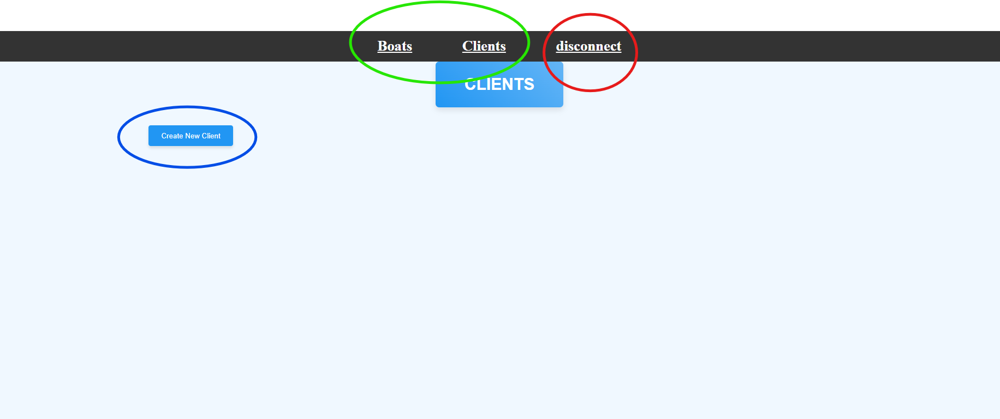
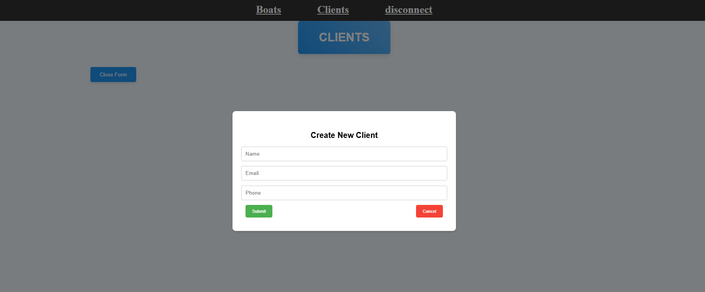
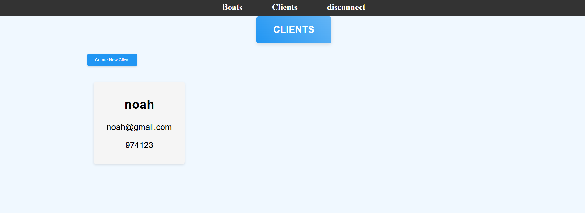
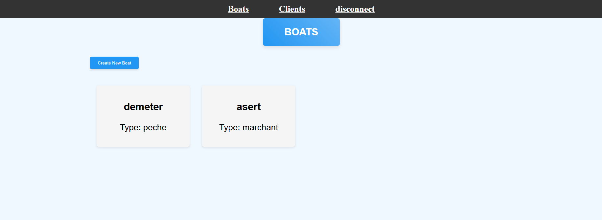
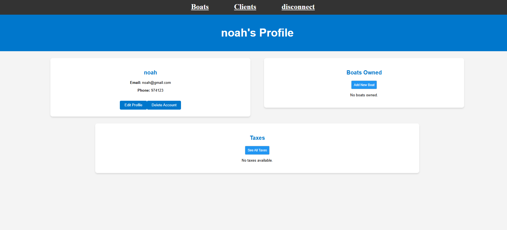
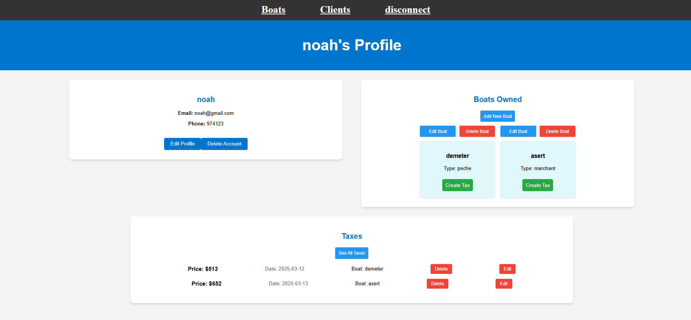

Voici la mise à jour du README avec les informations sur la page **Profil Client** et la gestion des factures de carburant associées aux bateaux du client :

---

# Lancer l'application avec Docker Compose

Ce projet utilise **Docker** pour exécuter un environnement avec trois services : une base de données PostgreSQL, une application backend NestJS, et une application frontend React.

## Prérequis

Avant de commencer, assurez-vous d'avoir les éléments suivants installés sur votre machine :

1. **Docker** : [Télécharger et installer Docker](https://www.docker.com/get-started)
2. **Docker Compose** : Docker Compose est généralement inclus avec Docker Desktop, mais vous pouvez également l'installer séparément : [Installer Docker Compose](https://docs.docker.com/compose/install/)

## Étapes pour lancer l'application

### 1. Cloner le projet

Si ce n'est pas déjà fait, commencez par cloner le projet sur votre machine locale :

```bash
git clone <URL_DU_REPOSITORY>
cd <NOM_DU_REPOSITORY>
```

### 2. Vérifier les Dockerfiles

Assurez-vous que les **Dockerfiles** dans les dossiers `./app` (pour React) et `./db/db` (pour NestJS) sont bien configurés.

### 3. Créer et démarrer les conteneurs

Dans le répertoire racine du projet, où se trouve le fichier `docker-compose.yml`, lancez la commande suivante pour créer et démarrer les conteneurs :

```bash
docker-compose up --build
```

Cette commande fait deux choses :
- **`--build`** : Elle construit les images Docker à partir des Dockerfiles pour l'application NestJS et l'application React.
- **`up`** : Elle démarre les conteneurs avec les configurations définies dans le fichier `docker-compose.yml`.

### 4. Accéder à l'application

- **Backend NestJS** : L'application backend sera accessible à l'adresse `http://localhost:3001`.
- **Frontend React** : L'application frontend sera accessible à l'adresse `http://localhost:3000`.
- **Base de données PostgreSQL** : PostgreSQL est exposé sur le port `5432`, et vous pouvez vous y connecter avec les informations suivantes :
  - **Utilisateur** : `root`
  - **Mot de passe** : `root`
  - **Base de données** : `my_database`

### 5. Arrêter les conteneurs

Une fois que vous avez fini d'utiliser l'application, vous pouvez arrêter les conteneurs en appuyant sur `Ctrl+C` dans le terminal, puis en exécutant la commande suivante pour supprimer les conteneurs créés :

```bash
docker-compose down
```

Cela arrêtera tous les services et supprimera les conteneurs, mais conservera les volumes et réseaux définis.

---

### Détails des services Docker

- **`db` (PostgreSQL)** : Conteneur PostgreSQL qui est utilisé pour stocker les données de l'application.
- **`app` (NestJS)** : Conteneur pour l'application backend NestJS, qui se connecte à la base de données PostgreSQL.
- **`react`** : Conteneur pour l'application frontend React, qui est exposé sur le port `3000`.

---

### Interface Utilisateur

Voici une vue d'ensemble de l'interface utilisateur de l'application :

- Dans le **cercle bleu**, un bouton permet d'ouvrir un popup pour créer un client.
- Dans le **cercle vert**, une **navbar** est présente, permettant de rediriger vers la page client.
- Dans le **cercle rouge**, vous trouverez un bouton **Disconnect** pour déconnecter l'utilisateur.

#### Page des Clients

Lorsque vous cliquez sur la **carte utilisateur**, vous êtes redirigé vers la page du profil client où vous pouvez ajouter des **bateaux** au client. Vous pouvez également ajouter des **taxes de carburant** pour chaque bateau du client.

------



---



---



---

#### Page des Bateaux

Sur la **page des Bateaux**, chaque carte de bateau redirige vers la **page de profil client** du propriétaire du bateau. Cela permet de consulter facilement tous les détails associés au client et à son bateau.

-------


---

#### Page Profil Client

La **page Profil Client** est l'endroit où vous pouvez gérer tous les aspects du compte d'un client, y compris :

- **Modification du profil** : Vous pouvez mettre à jour les informations du client, comme ses coordonnées.
- **Ajout de bateaux** : Vous pouvez ajouter de nouveaux bateaux au profil du client.
- **Ajout de factures de carburant** : Vous pouvez ajouter des taxes de carburant à chaque bateau du client.
- **Gestion des factures** : En cliquant sur chaque bateau, vous pouvez voir toutes les factures associées à ce bateau. Vous pouvez aussi cliquer sur **See All Taxes** pour afficher la liste complète des taxes de carburant liées à ce client.

**Note importante** : Si vous ajoutez une taxe de carburant, il est recommandé de **recliquer sur la carte du bateau** ou sur le bouton **See All Taxes** pour rafraîchir la page et voir les changements apportés.



---



Voici une explication de la structure de votre base de données et une mise à jour de votre README pour refléter cette structure :

---

## Structure de la Base de Données

Votre base de données contient trois entités principales : **User**, **IBoat**, et **Tax**. Voici les détails des tables et de leurs relations :

### 1. **User**
L'entité **User** représente un utilisateur de votre application. Elle contient les informations personnelles de l'utilisateur, telles que son nom, son email et son téléphone. Un utilisateur peut posséder plusieurs bateaux, ce qui est représenté par un tableau d'objets **IBoat**.

**Champs :**
- `id`: Identifiant unique de l'utilisateur.
- `name`: Le nom de l'utilisateur.
- `email`: L'adresse email de l'utilisateur.
- `phone`: Le numéro de téléphone de l'utilisateur.
- `boats`: Liste des bateaux appartenant à l'utilisateur (relation avec l'entité **IBoat**).

### 2. **IBoat**
L'entité **IBoat** représente un bateau. Chaque bateau a un nom, un type, un propriétaire, et une liste de taxes associées. Le propriétaire est identifié par l'`id` de l'utilisateur, qui est une clé étrangère.

**Champs :**
- `id`: Identifiant unique du bateau.
- `name`: Le nom du bateau.
- `type`: Le type de bateau (par exemple, yacht, voilier, etc.).
- `owner`: Identifiant de l'utilisateur propriétaire du bateau (relation avec l'entité **User**).
- `taxes`: Liste des taxes associées à ce bateau (relation avec l'entité **Tax**).

### 3. **Tax**
L'entité **Tax** représente une taxe associée à un bateau. Chaque taxe a un prix, un identifiant de bateau, et une date. Elle est liée à un bateau spécifique via le champ `boatId`.

**Champs :**
- `id`: Identifiant unique de la taxe.
- `price`: Le prix de la taxe de carburant.
- `boatId`: L'identifiant du bateau auquel la taxe est associée (clé étrangère vers **IBoat**).
- `date`: La date à laquelle la taxe a été appliquée.
